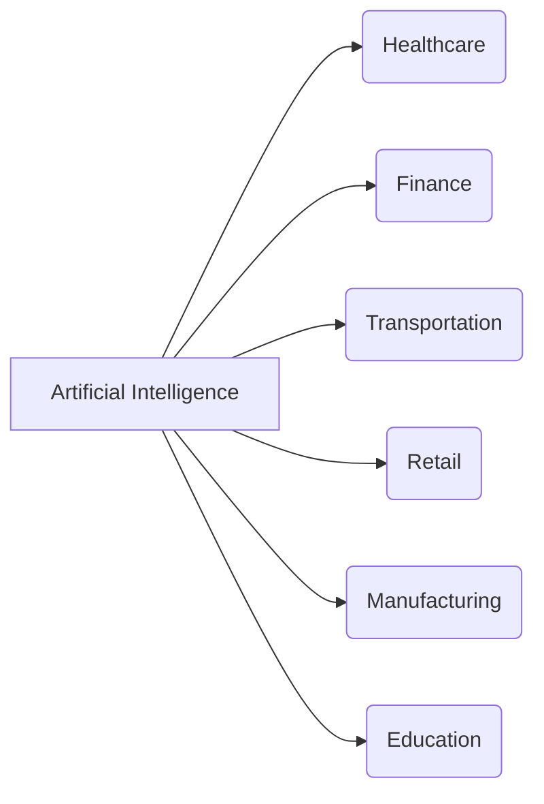

```markdown
# Artificial Intelligence: A Comprehensive Guide to Understanding AI

Artificial intelligence (AI) is no longer a futuristic concept confined to science fiction. It's a tangible force shaping our world, from the algorithms that recommend our next binge-watching session to the sophisticated systems driving self-driving cars. But what exactly *is* **artificial intelligence**, and how is it impacting our lives? This comprehensive guide will break down the complexities of AI, exploring its different types, applications, ethical considerations, and future potential.

## What is Artificial Intelligence?

At its core, **artificial intelligence** refers to the ability of a computer or a machine to mimic human cognitive functions such as learning, problem-solving, and decision-making. It involves creating systems that can reason, understand natural language, recognize patterns, and even exhibit creativity. Alan Turing, a pioneer in computer science, famously proposed the "Turing Test" as a benchmark for machine intelligence. While the definition evolves with technological advancements, the fundamental goal remains the same: to build machines that can perform tasks that typically require human intelligence.

## Types of Artificial Intelligence

AI isn't a monolith. It encompasses a wide range of approaches and capabilities, typically categorized into different types:

*   **Narrow or Weak AI (ANI):** This is the most prevalent type of AI today. It's designed to perform a specific task extremely well, such as playing chess (like Deep Blue), recommending products, or filtering spam emails. Narrow AI doesn't possess general intelligence or consciousness.

*   **General or Strong AI (AGI):** This refers to a hypothetical AI that possesses human-level intelligence. An AGI would be capable of understanding, learning, and applying its knowledge to any intellectual task that a human being can. No true AGI exists currently.

*   **Super AI (ASI):** This is a hypothetical level of AI that surpasses human intelligence in all aspects, including creativity, problem-solving, and general wisdom. ASI is a subject of much debate and speculation, with concerns raised about its potential risks and benefits.

Furthermore, AI can be classified based on its capabilities:

*   **Reactive Machines:** These are the most basic type of AI, capable only of reacting to immediate situations based on pre-programmed rules. IBM's Deep Blue is an example.

*   **Limited Memory:** These AIs can learn from past experiences and use that knowledge to make decisions. Most AI applications today fall into this category.

*   **Theory of Mind:** This represents a more advanced level of AI that understands that other entities (humans, machines) have beliefs, desires, and intentions that affect their behavior.

*   **Self-Aware:** This is the most advanced and hypothetical type of AI, possessing consciousness and self-awareness.

## Applications of Artificial Intelligence

**Artificial intelligence** is already transforming various industries and aspects of our lives:

*   **Healthcare:** AI is used for diagnosing diseases, personalizing treatment plans, drug discovery, and robotic surgery. IBM's Watson, for example, has been applied to cancer research.
*   **Finance:** AI powers fraud detection, algorithmic trading, risk management, and customer service chatbots.
*   **Transportation:** Self-driving cars, optimized traffic flow, and drone delivery systems are all driven by AI.
*   **Retail:** AI is used for personalized recommendations, inventory management, and customer service.
*   **Manufacturing:** AI enables predictive maintenance, quality control, and robotic automation.
*   **Education:** AI can personalize learning experiences, automate grading, and provide intelligent tutoring systems.



## The Ethical Considerations of AI

As AI becomes more powerful and pervasive, it's crucial to address the ethical implications:

*   **Bias and Discrimination:** AI systems can perpetuate and amplify existing biases if trained on biased data. Ensuring fairness and equity is critical.
*   **Job Displacement:** The automation capabilities of AI raise concerns about job losses in various industries.
*   **Privacy:** AI systems often require vast amounts of data, raising concerns about data privacy and security.
*   **Accountability:** Determining accountability when an AI system makes a mistake or causes harm is a complex issue.
*   **Autonomous Weapons:** The development of autonomous weapons systems raises serious ethical questions about the role of AI in warfare.

Addressing these ethical challenges requires careful planning, regulation, and ongoing dialogue. Organizations like the Partnership on AI are working to promote responsible AI development and deployment.

## The Future of AI

The future of **artificial intelligence** is brimming with possibilities. We can expect to see further advancements in:

*   **Natural Language Processing (NLP):** More sophisticated language models will enable better communication and understanding between humans and machines.
*   **Computer Vision:** AI systems will become even better at understanding and interpreting images and videos.
*   **Robotics:** Robots will become more intelligent, adaptable, and capable of performing complex tasks in various environments.
*   **AI-powered Automation:** Increased automation across industries will lead to greater efficiency and productivity.
*   **Personalized Experiences:** AI will continue to personalize our experiences in areas such as healthcare, education, and entertainment.

While the development of AGI and ASI remains uncertain, the potential impact of these technologies is profound.

## Conclusion

**Artificial intelligence** is a transformative technology with the potential to revolutionize our world. From healthcare to transportation to education, AI is already making a significant impact. Understanding the different types of AI, its applications, and the ethical considerations it raises is crucial for navigating this rapidly evolving landscape. As AI continues to advance, responsible development and deployment will be essential to ensure that it benefits all of humanity.
```

