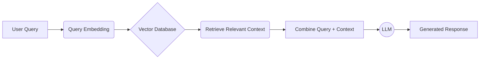

```markdown
# How to Build a Powerful Retrieval-Augmented Generation (RAG) System

Welcome to the exciting world of **Retrieval-Augmented Generation (RAG)**! In this article, we'll explore how you can build your own RAG system to enhance the performance of Large Language Models (LLMs) by grounding them in specific knowledge. Get ready to level up your AI projects!

## What is Retrieval-Augmented Generation (RAG)?

At its core, RAG is a technique that combines the strengths of information retrieval and text generation. Imagine an LLM that doesn't just rely on its pre-trained knowledge but can actively search for relevant information to inform its responses. That's RAG in action!

**Key Benefits of RAG:**

*   **Improved Accuracy:** RAG reduces hallucinations and provides more factually accurate responses by grounding LLMs in external knowledge.
*   **Up-to-date Information:** RAG can access and incorporate the latest information, overcoming the limitations of LLMs trained on static datasets.
*   **Explainability:** You can trace the source of information used to generate a response, enhancing transparency and trust.
*   **Customization:** RAG allows you to tailor LLMs to specific domains or datasets, making them more effective for niche applications.

## The RAG Pipeline: A Step-by-Step Guide

Building a RAG system involves several key stages. Let's break down the process:

1.  **Data Ingestion:** This is the first step, where you collect and prepare the data that will be used to augment the LLM's knowledge. This data can come from various sources, such as:
    *   Documents (PDFs, Word documents, etc.)
    *   Web pages
    *   Databases
    *   APIs
    *   Plain Text Files

    Data preparation often involves cleaning, structuring, and potentially splitting the data into smaller chunks for better retrieval.

2.  **Indexing:** The ingested data needs to be indexed to enable efficient searching. This involves creating vector embeddings of the data chunks. Here's how it works:
    *   **Text Chunking:** Divide the data into manageable chunks.
    *   **Embedding Generation:** Use a **vector embedding model** (like OpenAI's `text-embedding-ada-002` or open-source alternatives like Sentence Transformers) to convert each chunk into a high-dimensional vector representation. These vectors capture the semantic meaning of the text.
    *   **Vector Database Storage:** Store these vector embeddings in a **vector database** (also known as a vector store), such as Pinecone, Chroma, Weaviate, or FAISS. These databases are optimized for similarity searches.

3.  **Retrieval:** When a user asks a question, the retrieval stage finds the most relevant chunks of information from the index. This process involves:
    *   **Query Embedding:** Embed the user's question using the same embedding model used for indexing.
    *   **Similarity Search:** Perform a similarity search in the vector database to find the chunks with the closest vector embeddings to the query embedding. This identifies the chunks that are most semantically related to the question.

4.  **Generation:** The retrieved context is combined with the original user query and fed to the LLM. The LLM then generates a response based on both its pre-trained knowledge and the retrieved information. This ensures the response is informed by the external knowledge base.
    *   **Prompt Engineering:** Craft a prompt that effectively instructs the LLM on how to use the retrieved context. This prompt might include instructions like "Answer the question based on the following context:" followed by the retrieved chunks.
    *   **LLM Inference:** Pass the prompt to the LLM (like GPT-3, Llama 2, or others). The LLM uses the context to generate a relevant and informative response.



## Choosing the Right Tools

Selecting the right tools is crucial for building an effective RAG system. Here are some popular options:

*   **LLMs:** OpenAI's GPT series, Llama 2, Cohere, AI21 Labs.
*   **Embedding Models:** OpenAI's `text-embedding-ada-002`, Sentence Transformers, Hugging Face Transformers.
*   **Vector Databases:** Pinecone, Chroma, Weaviate, FAISS, Milvus.
*   **RAG Frameworks:** LangChain, LlamaIndex.

**LangChain** and **LlamaIndex** are particularly helpful as they provide abstractions and tools to simplify the RAG pipeline, allowing you to focus on the core logic of your application. They offer components for data loading, chunking, embedding, retrieval, and prompt engineering.

## Optimizing Your RAG System

Once you've built a basic RAG system, you can optimize its performance in several ways:

*   **Chunk Size Optimization:** Experiment with different chunk sizes to find the optimal balance between context length and retrieval accuracy. Smaller chunks might improve precision, while larger chunks might capture more context.
*   **Retrieval Strategies:** Explore different retrieval techniques, such as:
    *   **Semantic Search:** Using vector embeddings for similarity search.
    *   **Keyword Search:** Combining semantic search with traditional keyword-based search.
    *   **Hybrid Search:** Blending different retrieval methods for improved results.
*   **Prompt Engineering:** Fine-tune the prompts used to instruct the LLM on how to use the retrieved context. Experiment with different prompt formats and instructions to maximize the quality of the generated responses.
*   **Re-ranking:** After retrieving a set of potentially relevant chunks, use a re-ranking model to score and re-order them based on their relevance to the query. This can improve the accuracy of the retrieved context.
*   **Evaluation:** Regularly evaluate the performance of your RAG system using relevant metrics, such as accuracy, relevance, and fluency. Use these metrics to identify areas for improvement and guide your optimization efforts.

## Potential Challenges

Building a RAG system isn't always straightforward. Here are some common challenges:

*   **Context Length Limitations:** LLMs have a limited context window, which can restrict the amount of retrieved information they can effectively use.
*   **Noisy or Irrelevant Retrieved Content:** The retrieval stage might return irrelevant or noisy information, which can negatively impact the quality of the generated responses.
*   **Computational Cost:** Embedding and similarity search can be computationally expensive, especially for large datasets.
*   **Hallucinations:** Even with RAG, LLMs can still generate hallucinations or incorrect information.

## Conclusion

Building a RAG system is a powerful way to enhance the capabilities of LLMs and unlock new possibilities for AI applications. By combining the strengths of retrieval and generation, you can create systems that are more accurate, up-to-date, and tailored to specific domains. So, dive in, experiment, and start building your own RAG system today!
```

