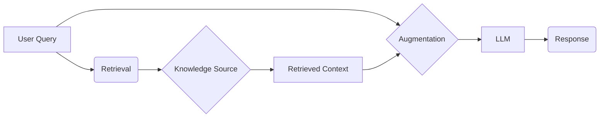

```markdown
# Unlock the Power of Your Data with Retrieval-Augmented Generation (RAG)

Are you ready to supercharge your Large Language Models (LLMs) and make them even more knowledgeable and relevant? Enter **Retrieval-Augmented Generation (RAG)**, a game-changing technique that allows LLMs to access and incorporate external knowledge sources, resulting in more accurate, context-aware, and insightful outputs. In this article, we'll dive deep into RAG, exploring its benefits, how it works, and why it's becoming a cornerstone of modern AI applications.

## What is Retrieval-Augmented Generation (RAG)?

At its core, **RAG** is a framework that enhances the capabilities of LLMs by allowing them to retrieve information from external sources *before* generating a response. Think of it as giving your LLM a research assistant who can quickly gather relevant information to inform its answers. This prevents the LLM from relying solely on its pre-trained knowledge, which may be outdated, incomplete, or simply incorrect.

**Key Benefit:** RAG addresses the limitations of LLMs by bridging the gap between their vast, yet static, knowledge base and the ever-evolving world of information. This leads to more accurate, trustworthy, and informative outputs.

## How Does RAG Work? A Step-by-Step Breakdown

The RAG process typically involves these key steps:

1.  **Query:** The user poses a question or provides a prompt to the system.
2.  **Retrieval:** This is the crucial step where the system searches external knowledge sources (e.g., a document database, a website, a knowledge graph) for relevant information based on the user's query.  Techniques like semantic search and vector embeddings are commonly used for efficient information retrieval.
3.  **Augmentation:** The retrieved information is combined with the original user query. This augmented prompt now contains both the user's question and the relevant context retrieved from external sources.
4.  **Generation:** The LLM takes the augmented prompt as input and generates a response. Because the prompt now includes up-to-date and relevant information, the LLM can provide a more informed, accurate, and context-aware answer.

Here's a simple visualization using **Mermaid.js**:



## Benefits of Using RAG

*   **Improved Accuracy:** By grounding its responses in external knowledge, RAG helps LLMs avoid generating factually incorrect or outdated information.
*   **Enhanced Contextual Understanding:**  RAG enables LLMs to understand the nuances of a question by providing relevant context, leading to more relevant and helpful responses.
*   **Reduced Hallucinations:** One of the biggest challenges with LLMs is their tendency to "hallucinate" or invent information. RAG mitigates this by forcing the LLM to base its responses on verifiable external sources.
*   **Increased Transparency:** With RAG, you can often trace the source of the information used to generate a response, making the process more transparent and trustworthy.  This is often implemented by citing the source documents used.
*   **Adaptability to New Information:** RAG allows LLMs to quickly adapt to new information by simply updating the external knowledge sources. This eliminates the need to retrain the entire LLM every time new data becomes available.
*   **Cost-Effectiveness:** Updating knowledge bases is far more efficient and cost-effective than constantly retraining large LLMs.

## Applications of RAG

RAG is being used in a wide range of applications, including:

*   **Question Answering:** Providing accurate and informative answers to complex questions based on a vast knowledge base.
*   **Chatbots:** Creating more intelligent and helpful chatbots that can access and incorporate real-time information.
*   **Content Generation:** Generating high-quality content that is both informative and accurate.
*   **Code Generation:**  Improving code generation by providing access to relevant documentation and code examples.
*   **Research Assistance:** Helping researchers quickly find and synthesize information from a variety of sources.

##  RAG vs. Fine-Tuning: Which is Right for You?

While both **RAG** and **fine-tuning** aim to improve the performance of LLMs, they address different needs. Fine-tuning involves training an LLM on a specific dataset to adapt it to a particular task or domain. RAG, on the other hand, enhances an LLM's knowledge by providing it with access to external information at inference time.

Here's a quick comparison:

| Feature         | RAG                                      | Fine-Tuning                               |
|-----------------|------------------------------------------|-------------------------------------------|
| **Knowledge Source**| External, dynamic, and updatable         | Internal, static, pre-trained            |
| **Training Required**| No (after initial setup)                   | Yes                                         |
| **Cost**        | Lower (generally)                        | Higher (due to training costs)            |
| **Adaptability**   | Highly adaptable to new information       | Requires re-training for new information |
| **Use Case**     | When access to external knowledge is crucial | When adapting to a specific task/domain   |

In many cases, a combination of RAG and fine-tuning can provide the best results. For instance, you might fine-tune an LLM on a specific domain and then use RAG to augment its knowledge with real-time information from external sources.

## Conclusion

**Retrieval-Augmented Generation (RAG)** is a powerful technique that is transforming the way we use Large Language Models. By enabling LLMs to access and incorporate external knowledge, RAG improves accuracy, enhances contextual understanding, and reduces hallucinations. As LLMs continue to evolve, RAG will likely become an increasingly important tool for building intelligent and reliable AI applications. So, if you're looking to unlock the full potential of your LLMs, it's time to explore the world of RAG!


